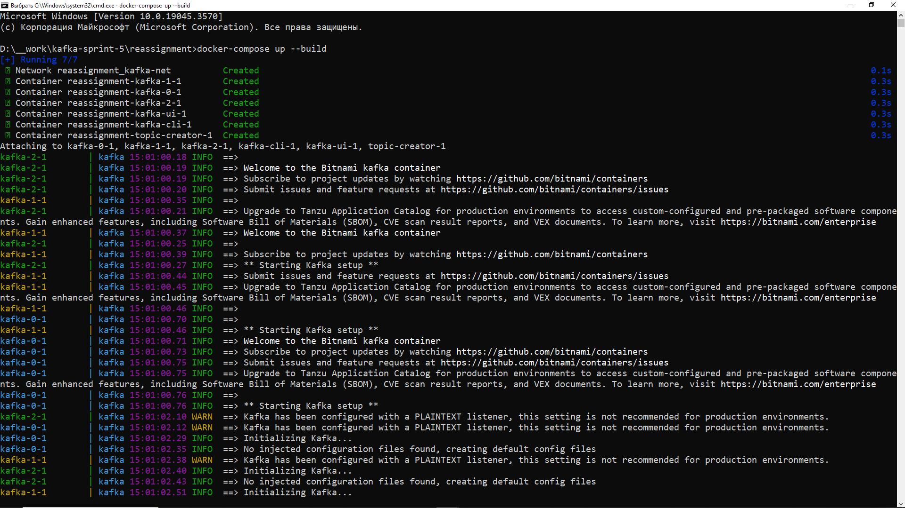
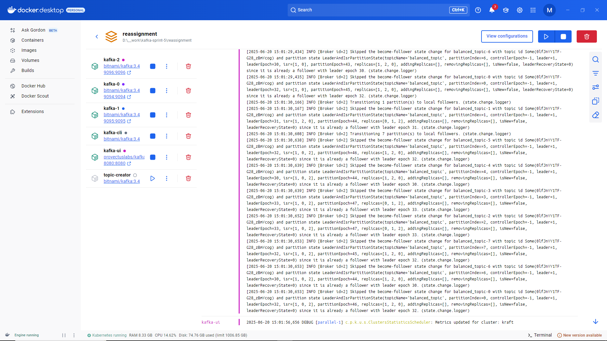
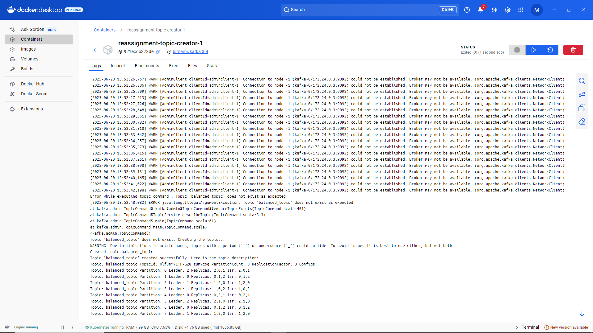
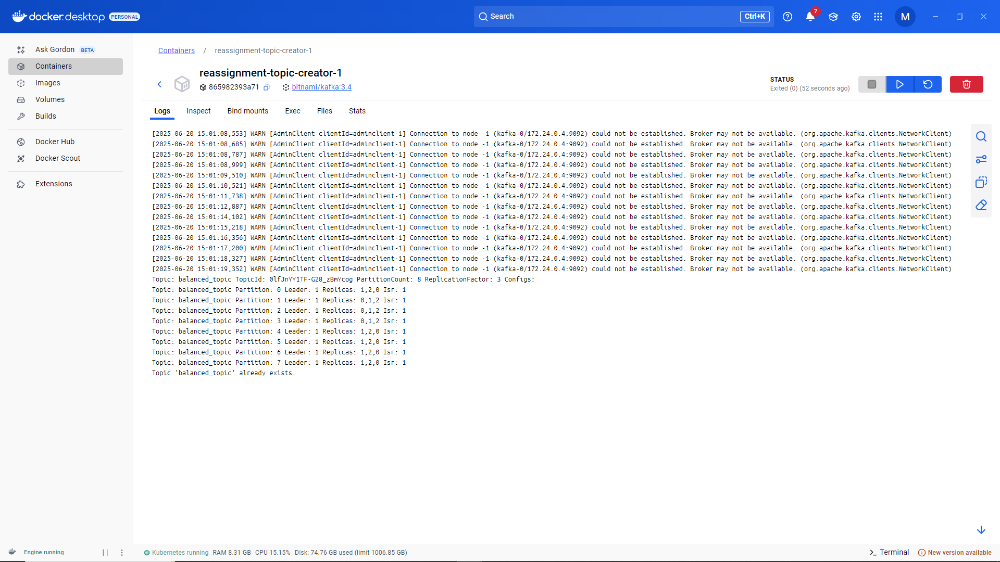
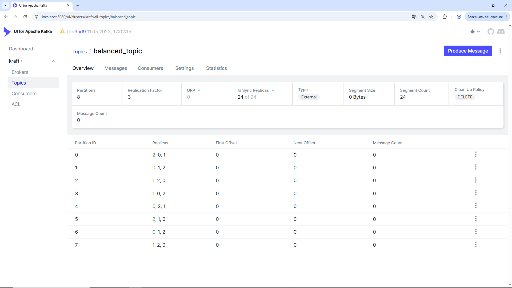
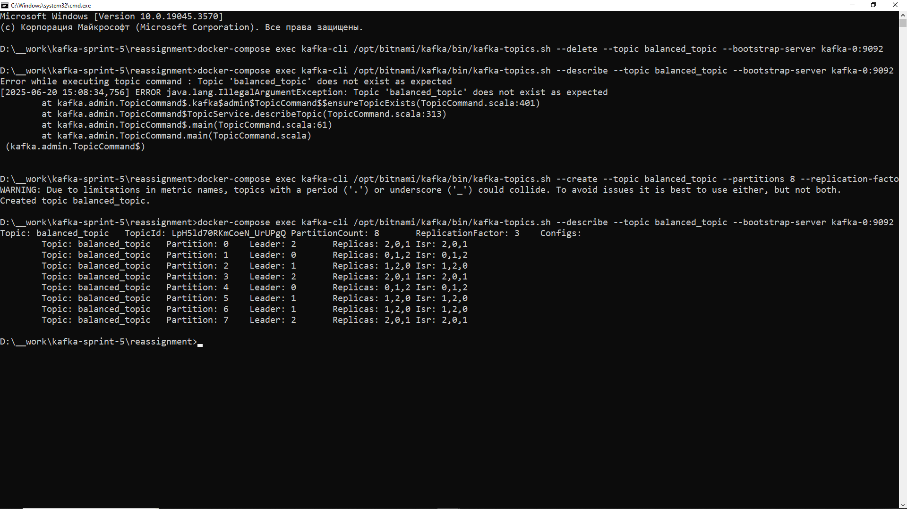
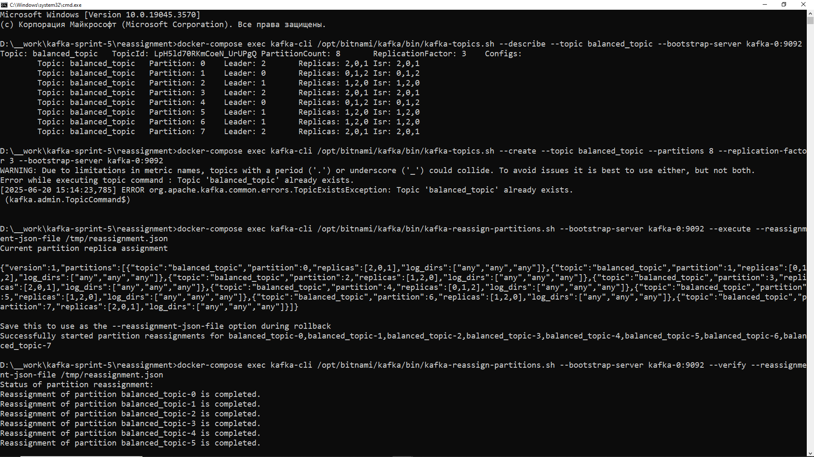
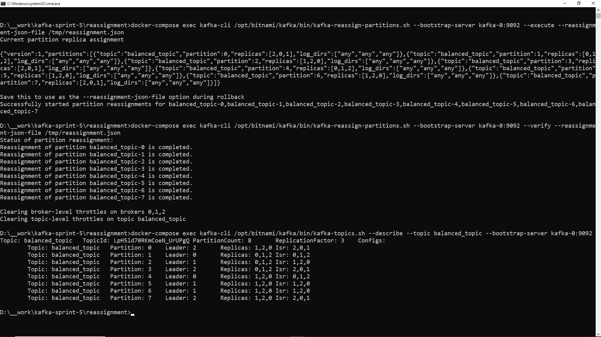
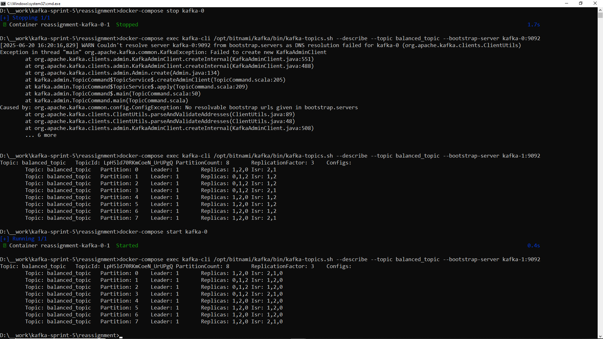

# Задание 1. Балансировка партиций и диагностика кластера

## Цели задания:
- Освоить балансировку партиций и распределение нагрузки с помощью Partition Reassignment Tools.
- Попрактиковаться в диагностике и устранении проблем кластера.

## Описание всех сервисов (конфигурация)

Приложение разворачивается посредтством запуска Docker Compose сервисов на основе описания в [docker-compose.yml](docker-compose.yml):

```
docker-compose up --build
```

При этом сервис `topic-creator` в описании [docker-compose.yml](docker-compose.yml) создаёт тему 
`balanced_topic`  на основании следующих параметров партиций (`8` партиций)и фактора репликации (`3`)
(детали см. файл [scripts/create-topic.sh](scripts/create-topic.sh)):

```
/opt/bitnami/kafka/bin/kafka-topics.sh --create --topic "$TOPIC_NAME" --partitions 8 --replication-factor 3 --bootstrap-server kafka-0:9092
```

### ВАЖНО: 

Перед сборкой проекта, определите свой IP-адрес  
...его, для успешного старта приложения, необходимо прописать   
в docker-compose.yml (в корневом каталоге)  
во всех определениях сервисов Kafka вместо 0.0.0.0:  

```- KAFKA_CFG_ADVERTISED_LISTENERS=PLAINTEXT://kafka-0:9092,EXTERNAL://0.0.0.0:9094```

Заменить все ```0.0.0.0``` на Ваш IP-адрес.

```- KAFKA_CFG_ADVERTISED_LISTENERS=PLAINTEXT://kafka-0:9092,EXTERNAL://<ВАШ_IP_АДРЕС>:9094```

Определение IP для Windows:
- Запустите cmd и введите:
```ipconfig```

Например, вывод:
```
Ethernet adapter Ethernet: 
  IPv4 Address . . . . . . . . . : 192.168.X.Y
```
Здесь, ваш IP-адрес — ```192.168.X.Y```

Аналогично в Linux:
```ip addr show```

После внесение корректировок в [docker-compose.yml](docker-compose.yml), соберите и запустите 
контейнеры с помощью Docker Compose из корневого каталога проекта:

```docker-compose up --build```


Полное описание файла [docker-compose.yml](docker-compose.yml):

```
services:
  kafka-0:
    image: bitnami/kafka:3.4
    ports:
      - "9094:9094"
    environment:
      - KAFKA_ENABLE_KRAFT=yes
      - KAFKA_CFG_PROCESS_ROLES=broker,controller
      - KAFKA_CFG_CONTROLLER_LISTENER_NAMES=CONTROLLER
      - ALLOW_PLAINTEXT_LISTENER=yes
      - KAFKA_CFG_NODE_ID=0
      - KAFKA_CFG_CONTROLLER_QUORUM_VOTERS=0@kafka-0:9093,1@kafka-1:9093,2@kafka-2:9093
      - KAFKA_KRAFT_CLUSTER_ID=abcdefghijklmnopqrstuv
      - KAFKA_CFG_LISTENERS=PLAINTEXT://:9092,CONTROLLER://:9093,EXTERNAL://:9094
      - KAFKA_CFG_ADVERTISED_LISTENERS=PLAINTEXT://kafka-0:9092,EXTERNAL://0.0.0.0:9094
      - KAFKA_CFG_LISTENER_SECURITY_PROTOCOL_MAP=CONTROLLER:PLAINTEXT,EXTERNAL:PLAINTEXT,PLAINTEXT:PLAINTEXT   
    volumes:
      - kafka_0_data:/bitnami/kafka
    networks:
      - kafka-net  
   
  kafka-1:
    image: bitnami/kafka:3.4
    ports:
      - "9095:9095"
    environment:
      - KAFKA_ENABLE_KRAFT=yes
      - ALLOW_PLAINTEXT_LISTENER=yes
      - KAFKA_CFG_NODE_ID=1
      - KAFKA_CFG_PROCESS_ROLES=broker,controller
      - KAFKA_CFG_CONTROLLER_LISTENER_NAMES=CONTROLLER
      - KAFKA_CFG_CONTROLLER_QUORUM_VOTERS=0@kafka-0:9093,1@kafka-1:9093,2@kafka-2:9093
      - KAFKA_KRAFT_CLUSTER_ID=abcdefghijklmnopqrstuv
      - KAFKA_CFG_LISTENERS=PLAINTEXT://:9092,CONTROLLER://:9093,EXTERNAL://:9095
      - KAFKA_CFG_ADVERTISED_LISTENERS=PLAINTEXT://kafka-1:9092,EXTERNAL://0.0.0.0:9095
      - KAFKA_CFG_LISTENER_SECURITY_PROTOCOL_MAP=CONTROLLER:PLAINTEXT,EXTERNAL:PLAINTEXT,PLAINTEXT:PLAINTEXT   
    volumes:
      - kafka_1_data:/bitnami/kafka
    networks:
      - kafka-net
   
  kafka-2:
    image: bitnami/kafka:3.4
    ports:
      - "9096:9096"
    environment:
      - KAFKA_ENABLE_KRAFT=yes
      - ALLOW_PLAINTEXT_LISTENER=yes
      - KAFKA_CFG_NODE_ID=2
      - KAFKA_CFG_PROCESS_ROLES=broker,controller
      - KAFKA_CFG_CONTROLLER_LISTENER_NAMES=CONTROLLER
      - KAFKA_CFG_CONTROLLER_QUORUM_VOTERS=0@kafka-0:9093,1@kafka-1:9093,2@kafka-2:9093
      - KAFKA_KRAFT_CLUSTER_ID=abcdefghijklmnopqrstuv
      - KAFKA_CFG_LISTENERS=PLAINTEXT://:9092,CONTROLLER://:9093,EXTERNAL://:9096
      - KAFKA_CFG_ADVERTISED_LISTENERS=PLAINTEXT://kafka-2:9092,EXTERNAL://0.0.0.0:9096
      - KAFKA_CFG_LISTENER_SECURITY_PROTOCOL_MAP=CONTROLLER:PLAINTEXT,EXTERNAL:PLAINTEXT,PLAINTEXT:PLAINTEXT
    volumes:
      - kafka_2_data:/bitnami/kafka   
    networks:
      - kafka-net
   
  topic-creator:
    image: bitnami/kafka:3.4
    depends_on:
      - kafka-0
      - kafka-1
      - kafka-2
    volumes:
      - ./scripts/create-topic.sh:/create-topic.sh
    entrypoint: /bin/bash /create-topic.sh
    networks:
      - kafka-net

  kafka-ui:
    image: provectuslabs/kafka-ui:v0.7.0
    depends_on:
      - kafka-0
      - kafka-1
      - kafka-2
    ports:
      - "8080:8080"
    environment:
      KAFKA_CLUSTERS_0_NAME: kraft
      KAFKA_CLUSTERS_0_BOOTSTRAP_SERVERS: kafka-0:9092,kafka-1:9092,kafka-2:9092
    networks:
      - kafka-net

  kafka-cli:
    image: bitnami/kafka:3.4
    depends_on:
      - kafka-0
      - kafka-1
      - kafka-2
    volumes:
      - ./reassignment.json:/tmp/reassignment.json
    entrypoint: /bin/bash
    tty: true
    stdin_open: true
    networks:
      - kafka-net

networks:
  kafka-net:
    driver: bridge

volumes:
  kafka_0_data:
  kafka_1_data:
  kafka_2_data:
```

## Шаги для по созданию/удалению|обновлению существующей конфигурации кластера Kafka для фиксации выполнения задания (выполнения последующих шагов)

### 1. Удаление существующего топика (если есть)
```
docker-compose exec kafka-cli /opt/bitnami/kafka/bin/kafka-topics.sh --delete --topic balanced_topic --bootstrap-server kafka-0:9092
```

### 2. Проверка текущего состояния топика
```
docker-compose exec kafka-cli /opt/bitnami/kafka/bin/kafka-topics.sh --describe --topic balanced_topic --bootstrap-server kafka-0:9092
```

Вывод:  
```
	Error while executing topic command : Topic 'balanced_topic' does not exist as expected
	[2025-06-20 15:08:34,756] ERROR java.lang.IllegalArgumentException: Topic 'balanced_topic' does not exist as expected
			at kafka.admin.TopicCommand$.kafka$admin$TopicCommand$$ensureTopicExists(TopicCommand.scala:401)
			at kafka.admin.TopicCommand$TopicService.describeTopic(TopicCommand.scala:313)
			at kafka.admin.TopicCommand$.main(TopicCommand.scala:61)
			at kafka.admin.TopicCommand.main(TopicCommand.scala)
	 (kafka.admin.TopicCommand$)
```

### 3. Создание нового топика
```
docker-compose exec kafka-cli /opt/bitnami/kafka/bin/kafka-topics.sh --create --topic balanced_topic --partitions 8 --replication-factor 3 --bootstrap-server kafka-0:9092
```
Вывод:  
```
WARNING: Due to limitations in metric names, topics with a period ('.') or underscore ('_') could collide. To avoid issues it is best to use either, but not both.
	Created topic balanced_topic.
```

### 4. Описание только что созданного топика
```
docker-compose exec kafka-cli /opt/bitnami/kafka/bin/kafka-topics.sh --describe --topic balanced_topic --bootstrap-server kafka-0:9092
```
Вывод:  
```
	Topic: balanced_topic   TopicId: LpH5ld70RKmCoeN_UrUPgQ PartitionCount: 8       ReplicationFactor: 3    Configs:
			Topic: balanced_topic   Partition: 0    Leader: 2       Replicas: 2,0,1 Isr: 2,0,1
			Topic: balanced_topic   Partition: 1    Leader: 0       Replicas: 0,1,2 Isr: 0,1,2
			Topic: balanced_topic   Partition: 2    Leader: 1       Replicas: 1,2,0 Isr: 1,2,0
			Topic: balanced_topic   Partition: 3    Leader: 2       Replicas: 2,0,1 Isr: 2,0,1
			Topic: balanced_topic   Partition: 4    Leader: 0       Replicas: 0,1,2 Isr: 0,1,2
			Topic: balanced_topic   Partition: 5    Leader: 1       Replicas: 1,2,0 Isr: 1,2,0
			Topic: balanced_topic   Partition: 6    Leader: 1       Replicas: 1,2,0 Isr: 1,2,0
			Topic: balanced_topic   Partition: 7    Leader: 2       Replicas: 2,0,1 Isr: 2,0,1
```		

## Шаги при автоматическом создании темы (см. сервис `topic-creator` в [docker-compose.yml](docker-compose.yml) и скрипт [scripts/create-topic.sh](scripts/create-topic.sh) в каталоге [scripts](scripts):

```
#!/bin/bash

# Определяем имя темы
TOPIC_NAME="balanced_topic"

# Проверка существования темы
if /opt/bitnami/kafka/bin/kafka-topics.sh --describe --topic "$TOPIC_NAME" --bootstrap-server kafka-0:9092; then
    echo "Topic '$TOPIC_NAME' already exists."
else
    echo "Topic '$TOPIC_NAME' does not exist. Creating the topic..."
    # Создаем новую тему, если она не существует
    /opt/bitnami/kafka/bin/kafka-topics.sh --create --topic "$TOPIC_NAME" --partitions 8 --replication-factor 3 --bootstrap-server kafka-0:9092
    echo "Topic '$TOPIC_NAME' created successfully. Here is the topic description:"
    # Выводим описание вновь созданной темы
    /opt/bitnami/kafka/bin/kafka-topics.sh --describe --topic "$TOPIC_NAME" --bootstrap-server kafka-0:9092
fi
```

### 1. Проверка распределения партиций и брокеров

```
docker-compose exec kafka-cli /bin/bash
```

```
/opt/bitnami/kafka/bin/kafka-topics.sh --bootstrap-server kafka-1:9092 --describe --topic balanced_topic
```
Вывод:  
```
Topic: balanced_topic   TopicId: 0lfJnYY1TF-G28_zBmYcog PartitionCount: 8       ReplicationFactor: 3    Configs:
        Topic: balanced_topic   Partition: 0    Leader: 2       Replicas: 2,0,1 Isr: 0,2,1
        Topic: balanced_topic   Partition: 1    Leader: 0       Replicas: 0,1,2 Isr: 0,2,1
        Topic: balanced_topic   Partition: 2    Leader: 1       Replicas: 1,2,0 Isr: 0,2,1
        Topic: balanced_topic   Partition: 3    Leader: 1       Replicas: 1,0,2 Isr: 0,2,1
        Topic: balanced_topic   Partition: 4    Leader: 0       Replicas: 0,2,1 Isr: 0,1,2
        Topic: balanced_topic   Partition: 5    Leader: 2       Replicas: 2,1,0 Isr: 0,2,1
        Topic: balanced_topic   Partition: 6    Leader: 0       Replicas: 0,1,2 Isr: 0,2,1
        Topic: balanced_topic   Partition: 7    Leader: 1       Replicas: 1,2,0 Isr: 0,2,1
```
		
### 2. Проверка, повторное ручное создании топика (получаем ошибку, т.к. создано автоматически):
```
docker-compose exec kafka-cli /opt/bitnami/kafka/bin/kafka-topics.sh --create --topic balanced_topic --partitions 8 --replication-factor 3 --bootstrap-server kafka-0:9092
```
Вывод:  
```
WARNING: Due to limitations in metric names, topics with a period ('.') or underscore ('_') could collide. To avoid issues it is best to use either, but not both.
Error while executing topic command : Topic 'balanced_topic' already exists.
[2025-06-20 14:15:59,941] ERROR org.apache.kafka.common.errors.TopicExistsException: Topic 'balanced_topic' already exists.
 (kafka.admin.TopicCommand$)
```
		
### 3. Создание (ранее, до старта сервисов) файла перераспределения партиций ([reassignment.json](reassignment.json)):

```
{
 "version": 1,
 "partitions": [
   {"topic": "balanced_topic", "partition": 0, "replicas": [1, 2, 0]},
   {"topic": "balanced_topic", "partition": 1, "replicas": [0, 1, 2]},
   {"topic": "balanced_topic", "partition": 2, "replicas": [0, 1, 2]},
   {"topic": "balanced_topic", "partition": 3, "replicas": [0, 1, 2]},
   {"topic": "balanced_topic", "partition": 4, "replicas": [1, 2, 0]},
   {"topic": "balanced_topic", "partition": 5, "replicas": [1, 2, 0]},
   {"topic": "balanced_topic", "partition": 6, "replicas": [1, 2, 0]},
   {"topic": "balanced_topic", "partition": 7, "replicas": [1, 2, 0]}
 ]
}
```

### 4. Выполнение перераспределения партиций

```
docker-compose exec kafka-cli /opt/bitnami/kafka/bin/kafka-reassign-partitions.sh --bootstrap-server kafka-0:9092 --execute --reassignment-json-file /tmp/reassignment.json
```
Вывод:  
```
Current partition replica assignment

{"version":1,"partitions":[{"topic":"balanced_topic","partition":0,"replicas":[2,0,1],"log_dirs":["any","any","any"]},{"topic":"balanced_topic","partition":1,"replicas":[0,1,2],"log_dirs":["any","any","any"]},{"topic":"balanced_topic","partition":2,"replicas":[1,2,0],"log_dirs":["any","any","any"]},{"topic":"balanced_topic","partition":3,"replicas":[1,0,2],"log_dirs":["any","any","any"]},{"topic":"balanced_topic","partition":4,"replicas":[0,2,1],"log_dirs":["any","any","any"]},{"topic":"balanced_topic","partition":5,"replicas":[2,1,0],"log_dirs":["any","any","any"]},{"topic":"balanced_topic","partition":6,"replicas":[0,1,2],"log_dirs":["any","any","any"]},{"topic":"balanced_topic","partition":7,"replicas":[1,2,0],"log_dirs":["any","any","any"]}]}

Save this to use as the --reassignment-json-file option during rollback
Successfully started partition reassignments for balanced_topic-0,balanced_topic-1,balanced_topic-2,balanced_topic-3,balanced_topic-4,balanced_topic-5,balanced_topic-6,balanced_topic-7
```

### 5. Проверка статуса перераспределения

```
docker-compose exec kafka-cli /opt/bitnami/kafka/bin/kafka-reassign-partitions.sh --bootstrap-server kafka-0:9092 --verify --reassignment-json-file /tmp/reassignment.json
```
Вывод:  
```
Status of partition reassignment:
Reassignment of partition balanced_topic-0 is completed.
Reassignment of partition balanced_topic-1 is completed.
Reassignment of partition balanced_topic-2 is completed.
Reassignment of partition balanced_topic-3 is completed.
Reassignment of partition balanced_topic-4 is completed.
Reassignment of partition balanced_topic-5 is completed.
Reassignment of partition balanced_topic-6 is completed.
Reassignment of partition balanced_topic-7 is completed.

Clearing broker-level throttles on brokers 0,1,2
Clearing topic-level throttles on topic balanced_topic
```

### 6. Описание состояния топика после перераспределения

```
docker-compose exec kafka-cli /opt/bitnami/kafka/bin/kafka-topics.sh --describe --topic balanced_topic --bootstrap-server kafka-0:9092
```
Вывод:  
```
Topic: balanced_topic   TopicId: 0lfJnYY1TF-G28_zBmYcog PartitionCount: 8       ReplicationFactor: 3    Configs:
        Topic: balanced_topic   Partition: 0    Leader: 2       Replicas: 1,2,0 Isr: 2,1,0
        Topic: balanced_topic   Partition: 1    Leader: 2       Replicas: 0,1,2 Isr: 2,1,0
        Topic: balanced_topic   Partition: 2    Leader: 2       Replicas: 0,1,2 Isr: 2,1,0
        Topic: balanced_topic   Partition: 3    Leader: 2       Replicas: 0,1,2 Isr: 2,1,0
        Topic: balanced_topic   Partition: 4    Leader: 2       Replicas: 1,2,0 Isr: 2,1,0
        Topic: balanced_topic   Partition: 5    Leader: 2       Replicas: 1,2,0 Isr: 2,1,0
        Topic: balanced_topic   Partition: 6    Leader: 2       Replicas: 1,2,0 Isr: 2,1,0
        Topic: balanced_topic   Partition: 7    Leader: 2       Replicas: 1,2,0 Isr: 2,1,0
```

## Моделирование сбоя брокера

### 1. Остановка брокера kafka-0:

```
docker-compose stop kafka-0
```
Вывод:  
```
[+] Stopping 1/1
 ✔ Container reassignment-kafka-0-1  Stopped
```
 
### 2. Проверка состояния топиков после сбоя (брокер `kafka-0`)
```
docker-compose exec kafka-cli /opt/bitnami/kafka/bin/kafka-topics.sh --describe --topic balanced_topic --bootstrap-server kafka-0:9092
```
Вывод:  
```
[2025-06-20 14:46:39,740] WARN Couldn't resolve server kafka-0:9092 from bootstrap.servers as DNS resolution failed for kafka-0 (org.apache.kafka.clients.ClientUtils)
Exception in thread "main" org.apache.kafka.common.KafkaException: Failed to create new KafkaAdminClient
        at org.apache.kafka.clients.admin.KafkaAdminClient.createInternal(KafkaAdminClient.java:551)
        at org.apache.kafka.clients.admin.KafkaAdminClient.createInternal(KafkaAdminClient.java:488)
        at org.apache.kafka.clients.admin.Admin.create(Admin.java:134)
        at kafka.admin.TopicCommand$TopicService$.createAdminClient(TopicCommand.scala:205)
        at kafka.admin.TopicCommand$TopicService$.apply(TopicCommand.scala:209)
        at kafka.admin.TopicCommand$.main(TopicCommand.scala:50)
        at kafka.admin.TopicCommand.main(TopicCommand.scala)
Caused by: org.apache.kafka.common.config.ConfigException: No resolvable bootstrap urls given in bootstrap.servers
        at org.apache.kafka.clients.ClientUtils.parseAndValidateAddresses(ClientUtils.java:89)
        at org.apache.kafka.clients.ClientUtils.parseAndValidateAddresses(ClientUtils.java:48)
        at org.apache.kafka.clients.admin.KafkaAdminClient.createInternal(KafkaAdminClient.java:508)
        ... 6 more
```

### 3. Проверка состояния топиков после сбоя (брокер `kafka-1`)

```
docker-compose exec kafka-cli /opt/bitnami/kafka/bin/kafka-topics.sh --describe --topic balanced_topic --bootstrap-server kafka-1:9092
```
Вывод:  
```
Topic: balanced_topic   TopicId: 0lfJnYY1TF-G28_zBmYcog PartitionCount: 8       ReplicationFactor: 3    Configs:
        Topic: balanced_topic   Partition: 0    Leader: 1       Replicas: 1,2,0 Isr: 2,1
        Topic: balanced_topic   Partition: 1    Leader: 1       Replicas: 0,1,2 Isr: 2,1
        Topic: balanced_topic   Partition: 2    Leader: 1       Replicas: 0,1,2 Isr: 2,1
        Topic: balanced_topic   Partition: 3    Leader: 1       Replicas: 0,1,2 Isr: 2,1
        Topic: balanced_topic   Partition: 4    Leader: 1       Replicas: 1,2,0 Isr: 2,1
        Topic: balanced_topic   Partition: 5    Leader: 1       Replicas: 1,2,0 Isr: 2,1
        Topic: balanced_topic   Partition: 6    Leader: 1       Replicas: 1,2,0 Isr: 2,1
        Topic: balanced_topic   Partition: 7    Leader: 1       Replicas: 1,2,0 Isr: 2,1
```
		
### 4. Запуск брокера заново
```
docker-compose start kafka-0
```
Вывод:  
```
[+] Running 1/1
 ✔ Container reassignment-kafka-0-1  Started
``` 

### 5. Проверка состояния топиков
```
docker-compose exec kafka-cli /opt/bitnami/kafka/bin/kafka-topics.sh --describe --topic balanced_topic --bootstrap-server kafka-0:9092
```
Вывод:  
```
Topic: balanced_topic   TopicId: 0lfJnYY1TF-G28_zBmYcog PartitionCount: 8       ReplicationFactor: 3    Configs:
        Topic: balanced_topic   Partition: 0    Leader: 1       Replicas: 1,2,0 Isr: 2,1,0
        Topic: balanced_topic   Partition: 1    Leader: 1       Replicas: 0,1,2 Isr: 2,1,0
        Topic: balanced_topic   Partition: 2    Leader: 1       Replicas: 0,1,2 Isr: 2,1,0
        Topic: balanced_topic   Partition: 3    Leader: 1       Replicas: 0,1,2 Isr: 2,1,0
        Topic: balanced_topic   Partition: 4    Leader: 1       Replicas: 1,2,0 Isr: 2,1,0
        Topic: balanced_topic   Partition: 5    Leader: 1       Replicas: 1,2,0 Isr: 2,1,0
        Topic: balanced_topic   Partition: 6    Leader: 1       Replicas: 1,2,0 Isr: 2,1,0
        Topic: balanced_topic   Partition: 7    Leader: 1       Replicas: 1,2,0 Isr: 2,1,0
```

## Выводы

В ходе выполнения задания по балансировке партиций в Kafka мы успешно создали топик `balanced_topic` с `8` партициями и фактором репликации `3`, проанализировали текущее распределение партиций и провели перераспределение нагрузки с помощью `reassignment.json`. 
После моделирования сбоя брокера `kafka-0` произошло перераспределение партиций, это наглядно продемонстрировало гибкость системы в условиях сбоев. После возвращения выключенного брокера в строй, кластер, восстанавил начальное распределение нагрузки, благополучно вернувшись к предыдущему состоянию.

## Скриншоты (консоль выполнения команд, Docker Compose, Kafka UI)

### Общее:











### Подготовка, ручное пересоздание:



### Авто-создание и перераспределение:





### Остановка брокера, перераспределение, восстановление работы брокера:

