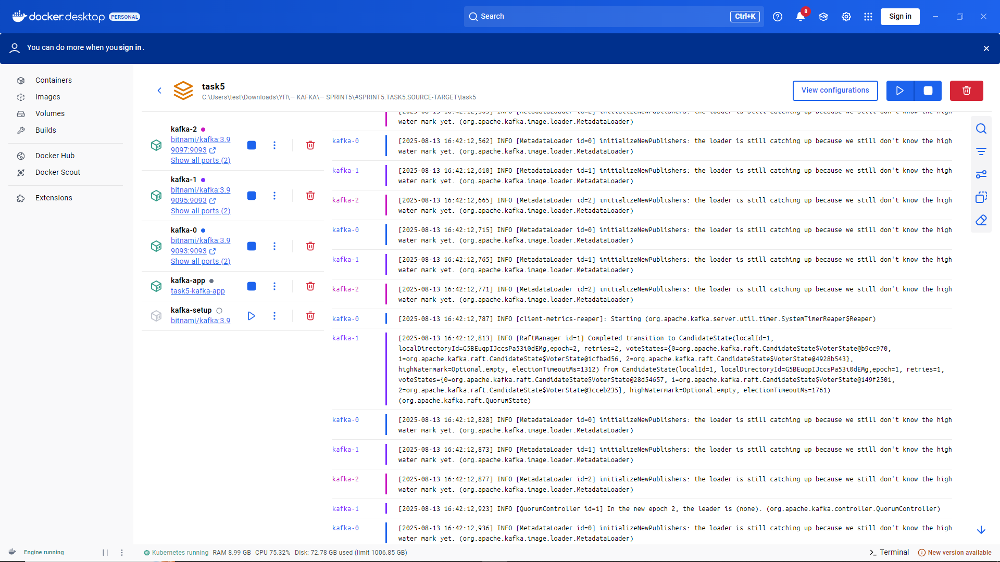
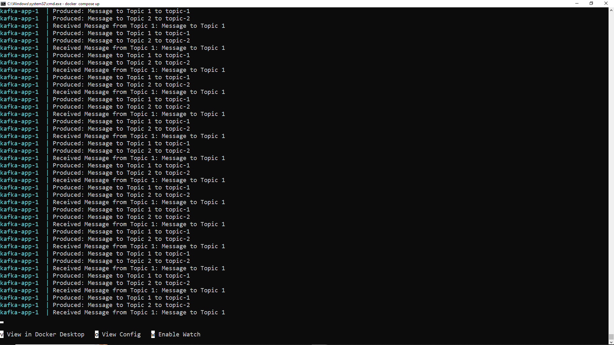
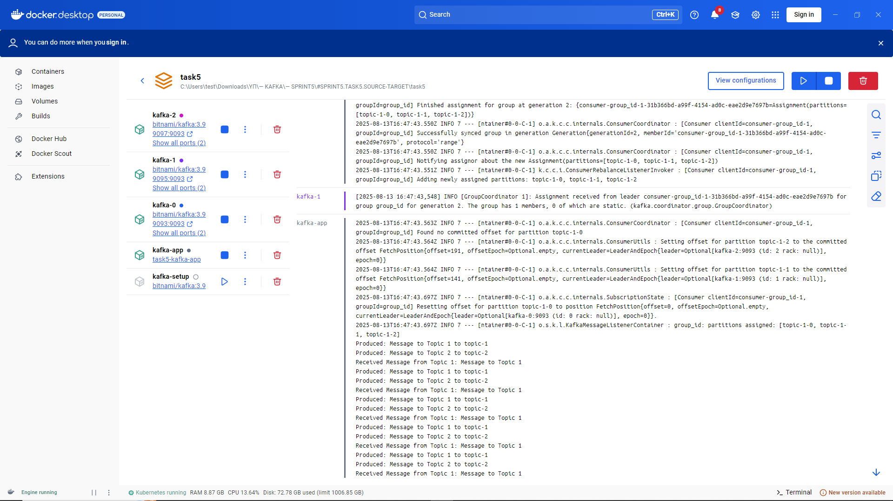
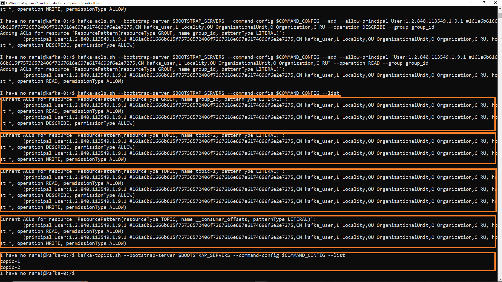

## Задание 2. Настройка защищённого соединения и управление доступом

### Цель задания — настроить защищённое SSL-соединение для кластера Apache Kafka из трёх брокеров с использованием Docker Compose, создать новый топик и протестировать отправку и получение зашифрованных сообщений.

### Описание работы приложения

Приложение производит сообщения по расписанию: компонент MessageProducer, используя интервал из `application.yml`, 
периодически отправляет фиксированные сообщения в оба топика (topic-1 и topic-2) через `KafkaTemplate`. 
Запись проходит успешно, потому что клиент (`User:kafka_user`), аутентифицированный по SSL-sertifikat'ам, 
имеет право Write на оба топика — брокер принимает и сохраняет эти сообщения в соответствующие партиции.  

Потребление происходит в момент появления сообщений в топике: `MessageListener` с `@KafkaListener` слушает 
topic-1 и сразу обрабатывает (выводит в консоль) поступившие записи, так как kafka_user имеет право Read 
на topic-1. Код также содержит слушатель для topic-2, но фактическое получение из этого топика в рабочем 
окружении не произойдёт — брокер отклонит попытки чтения, поскольку у `kafka_user` нет права `Read` на topic-2. 
Подписка может быть установлена на клиенте, но операции fetch будут отвергнуты авторизацией на стороне брокера 
и соответствующие ошибки появятся в логах клиента/брокера.  

Ключевым моментом является использование SSL для аутентификации и ACL для авторизации: SSL-ключи/кэжсторы 
гарантируют, что брокер видит корректный principal, а набор прав (`Write/Read/Describe`) определяет, 
какие операции разрешены. Права `Describe` оставлены для обоих топиков, чтобы клиент мог получать 
метаданные топиков без доступа к чтению их содержимого.  

### Запуск приложения (упрощённо)  

1. Собираем проект и запускаем приложение:  

```
docker compose build

docker compose up
```

2. Выполняем скрипты по созданию тем и настройке прав доступа (в [Topics и ACLs — инструкция по настройке](setup/Topics-n-ACLs-setup.md))  
	2.1 Переходим в консоль работающего контейнера Kafka-брокера:  
```
docker compose exec kafka-0 bash
```
	2.2 Проверяем наличие тем и установленных прав (если запускался/настраивался ранее):  

```
kafka-acls.sh --bootstrap-server $BOOTSTRAP_SERVERS --command-config $COMMAND_CONFIG --list

kafka-topics.sh --bootstrap-server $BOOTSTRAP_SERVERS --command-config $COMMAND_CONFIG --list
```
	2.3 Создаём темы. если не созданы и проверяем корректность создания:  

```
kafka-topics.sh --bootstrap-server $BOOTSTRAP_SERVERS --command-config $COMMAND_CONFIG --create --topic topic-1 --partitions 3 --replication-factor 3
kafka-topics.sh --bootstrap-server $BOOTSTRAP_SERVERS --command-config $COMMAND_CONFIG --create --topic topic-2 --partitions 3 --replication-factor 3

kafka-topics.sh --bootstrap-server $BOOTSTRAP_SERVERS --command-config $COMMAND_CONFIG --list
```
	2.4 Определяем последовательно права пользователя на темы, группы:  

```
kafka-acls.sh --bootstrap-server $BOOTSTRAP_SERVERS --command-config $COMMAND_CONFIG --add --allow-principal "User:1.2.840.113549.1.9.1=#161a6b61666b615f75736572406f7267616e697a6174696f6e2e7275,CN=kafka_user,L=Locality,OU=OrganizationalUnit,O=Organization,C=RU" --operation Write --topic topic-1
kafka-acls.sh --bootstrap-server $BOOTSTRAP_SERVERS --command-config $COMMAND_CONFIG --add --allow-principal "User:1.2.840.113549.1.9.1=#161a6b61666b615f75736572406f7267616e697a6174696f6e2e7275,CN=kafka_user,L=Locality,OU=OrganizationalUnit,O=Organization,C=RU" --operation Write --topic topic-2

kafka-acls.sh --bootstrap-server $BOOTSTRAP_SERVERS --command-config $COMMAND_CONFIG --add --allow-principal "User:1.2.840.113549.1.9.1=#161a6b61666b615f75736572406f7267616e697a6174696f6e2e7275,CN=kafka_user,L=Locality,OU=OrganizationalUnit,O=Organization,C=RU" --operation Read --topic topic-1

kafka-acls.sh --bootstrap-server $BOOTSTRAP_SERVERS --command-config $COMMAND_CONFIG --add --allow-principal "User:1.2.840.113549.1.9.1=#161a6b61666b615f75736572406f7267616e697a6174696f6e2e7275,CN=kafka_user,L=Locality,OU=OrganizationalUnit,O=Organization,C=RU" --operation Describe --topic topic-1
kafka-acls.sh --bootstrap-server $BOOTSTRAP_SERVERS --command-config $COMMAND_CONFIG --add --allow-principal "User:1.2.840.113549.1.9.1=#161a6b61666b615f75736572406f7267616e697a6174696f6e2e7275,CN=kafka_user,L=Locality,OU=OrganizationalUnit,O=Organization,C=RU" --operation Describe --topic topic-2

kafka-acls.sh --bootstrap-server $BOOTSTRAP_SERVERS --command-config $COMMAND_CONFIG --add --allow-principal User:1.2.840.113549.1.9.1="#161a6b61666b615f75736572406f7267616e697a6174696f6e2e7275,CN=kafka_user,L=Locality,OU=OrganizationalUnit,O=Organization,C=RU" --operation READ --topic __consumer_offsets
kafka-acls.sh --bootstrap-server $BOOTSTRAP_SERVERS --command-config $COMMAND_CONFIG --add --allow-principal User:1.2.840.113549.1.9.1="#161a6b61666b615f75736572406f7267616e697a6174696f6e2e7275,CN=kafka_user,L=Locality,OU=OrganizationalUnit,O=Organization,C=RU" --operation WRITE --topic __consumer_offsets

kafka-acls.sh --bootstrap-server $BOOTSTRAP_SERVERS --command-config $COMMAND_CONFIG --add --allow-principal User:1.2.840.113549.1.9.1=#161a6b61666b615f75736572406f7267616e697a6174696f6e2e7275,CN=kafka_user,L=Locality,OU=OrganizationalUnit,O=Organization,C=RU --operation DESCRIBE --group group_id
kafka-acls.sh --bootstrap-server $BOOTSTRAP_SERVERS --command-config $COMMAND_CONFIG --add --allow-principal "User:1.2.840.113549.1.9.1=#161a6b61666b615f75736572406f7267616e697a6174696f6e2e7275,CN=kafka_user,L=Locality,OU=OrganizationalUnit,O=Organization,C=RU" --operation READ --group group_id
```
	2.5 Пользователю User:kafka_user соответствует точное именование, исходя из полного описания  
```
User:1.2.840.113549.1.9.1=#161a6b61666b615f75736572406f7267616e697a6174696f6e2e7275,CN=kafka_user,L=Locality,OU=OrganizationalUnit,O=Organization,C=RU
```

```
[req]
prompt = no
distinguished_name = dn
default_md = sha256
default_bits = 4096
req_extensions = v3_req

[ dn ]
countryName = RU
organizationName = Organization
organizationalUnitName = OrganizationalUnit
localityName = Locality
commonName = kafka_user
emailAddress = kafka_user@organization.ru

[ v3_req ]
basicConstraints = CA:FALSE
nsComment = "OpenSSL Generated Certificate"
keyUsage = critical, digitalSignature, keyEncipherment
extendedKeyUsage = clientAuth
```

	2.6 Рестартуем приложение kafka-app (чтобы применились настройки), либо весь кластер (уже преднастроенный).  
	
	2.7 Просматриваем log-и приложения, producer отправляет сообщения в две темы, consumer принимает (может принять, исходя из настроенных прав) лишь в одной из.  
		(Скриншоты см. в Заключении).  
	2.8 Останавливаем приложение:
```
docker compose down
```

Далее, более подробно...
	

### Структура проекта  

```
./
├── docker-compose.yml           	# Конфигурационный файл Docker Compose для управления многими сервисами, такими как Kafka и Zookeeper.
├── Dockerfile                    	# Файл для создания Docker-образа, описывающий, как собирать приложение.
├── README.md                     	# Файл с описанием проекта, инструкциями по настройке и использованию.
├── build.gradle                  	# Файл конфигурации сборки проекта для Gradle, включая зависимости и плагины.
├── settings.gradle               	# Файл, который определяет настройки для сборки проекта в Gradle.
├── gradlew                       	# Скрипт для запуска Gradle без необходимости установки Gradle на систему.
├── gradlew.bat                   	# Скрипт для Windows для запуска Gradle без необходимости установки Gradle на систему.
├── gradle                        	# Каталог для хранения файлов Gradle Wrapper.
│   └── wrapper
│       ├── gradle-wrapper.jar    	# JAR-файл для Gradle Wrapper, позволяющий скачать и использовать Gradle.
│       └── gradle-wrapper.properties 	# Файл конфигурации для указания версии Gradle, используемой в проекте.
├── setup                        	# Каталог для хранения изображений, связанных с проектом, таких как схемы и диаграммы.
│   └──  Topics-n-ACLs-setup.md 	# Настройка тем (создание), настройка прав доступа.
├── ca.cnf                        	# Конфигурационный файл для создания сертификата центра сертификации (CA).
├── ca.crt                        	# Содержит корневой сертификат CA, используемый для проверки.
├── ca.key                        	# Приватный ключ корневого CA.
├── ca.pem                        	# Форматированный в PEM корневой сертификат CA.
├── ca.srl                        	# Серийный номер для генерирования сертификатов.
├── generate_ca_key.bat          	# Скрипт для генерации ключа CA (только для Windows).
├── generate_keys.bat            	# Скрипт для генерации ключей и сертификатов (только для Windows).
├── generate_user_keys.bat       	# Скрипт для генерации ключей и сертификатов для пользователей Kafka (только для Windows).
├── images                        	# Каталог для хранения изображений, связанных с проектом, таких как схемы и диаграммы.
│   ├── kafka-brokers.png         			# Docker Desktop брокеров Kafka и приложения.
│   ├── producer-consumer-topic-1,2-console.png 	# Работа продюсеров и консумеров, вывод в консоль.
│   ├── producer-consumer-topic-1,2.png 		# Docker Desktop, консольный вывод.
│   └── topics-n-acls.png         			# Настройка топиков и прав доступа.
├── clients-creds                 	# Каталог для хранения учетных данных клиентов (продюсеров и консумеров).
│   ├── admin.properties           	# Файл настроек для клиента с правами администратора.
│   ├── consumer.properties        	# Файл настроек для Kafka клиента, который будет выступать в роли консумера.
│   ├── producer.properties        	# Файл настроек для Kafka клиента, который будет выступать в роли продюсера.
│   ├── kafka_user.cnf            	# Конфигурационный файл для создания сертификата пользователя Kafka.
│   ├── kafka_user.crt            	# Сертификат пользователя Kafka.
│   ├── kafka_user.csr            	# Запрос на сертификат (CSR) для пользователя Kafka.
│   ├── kafka_user.key            	# Приватный ключ пользователя Kafka.
│   ├── kafka_user.p12            	# Формат P12 для ключа и сертификата пользователя Kafka.
│   ├── kafka_user.keystore.jks   	# Хранилище ключей JKS для пользователя Kafka.
│   ├── kafka_user.pem            	# Формат PEM для сертификата пользователя Kafka.
│   └── kafka_user.truststore.jks 	# Хранилище доверительных сертификатов JKS для пользователя Kafka.
├── kafka-0-creds                 	# Аналогичный каталог для учетных данных для Kafka брокера 0.
│   ├── client.properties          	# Файл настроек клиента для брокера Kafka 0.
│   ├── kafka-0.cnf               	# Конфигурационный файл для создания сертификата брокера 0.
│   ├── kafka-0.crt               	# Сертификат брокера Kafka 0.
│   ├── kafka-0.csr               	# Запрос на сертификат (CSR) для брокера Kafka 0.
│   ├── kafka-0.key               	# Приватный ключ брокера Kafka 0.
│   ├── kafka-0.p12               	# Формат P12 для ключа и сертификата брокера Kafka 0.
│   ├── kafka-0.pem               	# Формат PEM для сертификата брокера Kafka 0.
│   ├── kafka-0_keystore_creds    	# Хранилище ключей для брокера Kafka 0.
│   ├── kafka-0_sslkey_creds      	# SSL-ключи для брокера Kafka 0.
│   ├── kafka-0_truststore_creds  	# Доверительные сертификаты для брокера Kafka 0.
│   ├── kafka.keystore.jks        	# Хранилище ключей JKS для брокера Kafka 0.
│   ├── kafka.truststore.jks      	# Доверительное хранилище JKS для брокера Kafka 0.
│   └── server.properties          	# Основной конфигурационный файл для брокера Kafka 0.
├── kafka-1-creds/                	# Аналогичная структура для учета данных брокера 1.
│   ├── <...>                     	# То же самое, что и в kafka-0-creds.
├── kafka-2-creds/                	# Аналогичная структура для учета данных брокера 2.
│   ├── <...>                     	# То же самое, что и в kafka-0-creds.
├── src                           	# Исходный код проекта.
│   └── main
│       ├── java                  	# Java-код проекта.
│       │   └── com               	# Корневая папка для Java-пакета.
│       │       └── example
│       │           └── kafka
│       │               ├── KafkaApplication.java 	# Основной класс приложения для запуска Kafka.
│       │               ├── config
│       │               │   └── KafkaConfig.java   	# Конфигурация Kafka-приложения.
│       │               ├── consumer
│       │               │   └── MessageListener.java 	# Класс для обработки входящих сообщений.
│       │               └── producer
│       │                   └── MessageProducer.java 	# Класс для отправки сообщений в Kafka.
│       └── resources
│           └── application.yml   	# Файл конфигурации приложения в формате YAML.

```

### Описание всех сервисов (конфигурация) [docker-compose.yml](docker-compose.yml):  

```
version: "3.9"

services:
  kafka-0:
    image: bitnami/kafka:3.9
    hostname: kafka-0
    container_name: kafka-0
    ports:
      - "9093:9093"
      - "9094:9094"
    environment:
      KAFKA_ENABLE_KRAFT: yes
      KAFKA_CFG_NODE_ID: 0
      KAFKA_CFG_PROCESS_ROLES: broker,controller
      KAFKA_CFG_CONTROLLER_LISTENER_NAMES: CONTROLLER
      KAFKA_CFG_CONTROLLER_QUORUM_VOTERS: 0@kafka-0:9094,1@kafka-1:9094,2@kafka-2:9094
      KAFKA_KRAFT_CLUSTER_ID: "REPLACE_WITH_CLUSTER_UUID"
      KAFKA_CFG_LISTENERS: SSL://0.0.0.0:9093,CONTROLLER://0.0.0.0:9094
      KAFKA_CFG_ADVERTISED_LISTENERS: SSL://kafka-0:9093,CONTROLLER://kafka-0:9094
      KAFKA_CFG_LISTENER_SECURITY_PROTOCOL_MAP: SSL:SSL,CONTROLLER:SSL
      KAFKA_CFG_INTER_BROKER_LISTENER_NAME: SSL
      KAFKA_CFG_SSL_CLIENT_AUTH: required
      KAFKA_CFG_SSL_TRUSTSTORE_LOCATION: /bitnami/kafka/config/certs/kafka.truststore.jks
      KAFKA_CFG_SSL_TRUSTSTORE_PASSWORD: changeit
      KAFKA_CFG_SSL_KEYSTORE_LOCATION: /bitnami/kafka/config/certs/kafka.keystore.jks
      KAFKA_CFG_SSL_KEYSTORE_PASSWORD: changeit
      KAFKA_CFG_SSL_KEY_PASSWORD: changeit
      KAFKA_CFG_AUTHORIZER_CLASS_NAME: org.apache.kafka.metadata.authorizer.StandardAuthorizer
      KAFKA_CFG_ALLOW_EVERYONE_IF_NO_ACL_FOUND: false
      KAFKA_LOG4J_LOGGERS: kafka.authorizer.logger=DEBUG
      KAFKA_CFG_AUTO_CREATE_TOPICS_ENABLE: "false"
      KAFKA_CFG_SUPER_USERS: "User:CN=kafka-0,L=Locality,OU=OrganizationalUnit,O=Organization,C=RU;User:CN=kafka-1,L=Locality,OU=OrganizationalUnit,O=Organization,C=RU;User:CN=kafka-2,L=Locality,OU=OrganizationalUnit,O=Organization,C=RU"
      BITNAMI_DEBUG: true
    volumes:
      - kafka_0_data:/bitnami/kafka
      - ./kafka-0-creds:/bitnami/kafka/config/certs:ro
    healthcheck:
      test: [ "CMD-SHELL", "kafka-topics.sh --bootstrap-server kafka-0:9093 --list --command-config /bitnami/kafka/config/certs/client.properties" ]
      interval: 30s
      timeout: 10s
      retries: 3
      start_period: 30s
    networks:
      - kafka_net

  kafka-1:
    image: bitnami/kafka:3.9
    hostname: kafka-1
    container_name: kafka-1
    ports:
      - "9095:9093"
      - "9096:9094"
    environment:
      KAFKA_ENABLE_KRAFT: yes
      KAFKA_CFG_NODE_ID: 1
      KAFKA_CFG_PROCESS_ROLES: broker,controller
      KAFKA_CFG_CONTROLLER_LISTENER_NAMES: CONTROLLER
      KAFKA_CFG_CONTROLLER_QUORUM_VOTERS: 0@kafka-0:9094,1@kafka-1:9094,2@kafka-2:9094
      KAFKA_KRAFT_CLUSTER_ID: "REPLACE_WITH_CLUSTER_UUID"
      KAFKA_CFG_LISTENERS: SSL://0.0.0.0:9093,CONTROLLER://0.0.0.0:9094
      KAFKA_CFG_ADVERTISED_LISTENERS: SSL://kafka-1:9093,CONTROLLER://kafka-1:9094
      KAFKA_CFG_LISTENER_SECURITY_PROTOCOL_MAP: SSL:SSL,CONTROLLER:SSL
      KAFKA_CFG_INTER_BROKER_LISTENER_NAME: SSL
      KAFKA_CFG_SSL_CLIENT_AUTH: required
      KAFKA_CFG_SSL_TRUSTSTORE_LOCATION: /bitnami/kafka/config/certs/kafka.truststore.jks
      KAFKA_CFG_SSL_TRUSTSTORE_PASSWORD: changeit
      KAFKA_CFG_SSL_KEYSTORE_LOCATION: /bitnami/kafka/config/certs/kafka.keystore.jks
      KAFKA_CFG_SSL_KEYSTORE_PASSWORD: changeit
      KAFKA_CFG_SSL_KEY_PASSWORD: changeit
      KAFKA_CFG_AUTHORIZER_CLASS_NAME: org.apache.kafka.metadata.authorizer.StandardAuthorizer
      KAFKA_CFG_ALLOW_EVERYONE_IF_NO_ACL_FOUND: false
      KAFKA_LOG4J_LOGGERS: kafka.authorizer.logger=DEBUG
      KAFKA_CFG_AUTO_CREATE_TOPICS_ENABLE: "false"
      KAFKA_CFG_SUPER_USERS: "User:CN=kafka-0,L=Locality,OU=OrganizationalUnit,O=Organization,C=RU;User:CN=kafka-1,L=Locality,OU=OrganizationalUnit,O=Organization,C=RU;User:CN=kafka-2,L=Locality,OU=OrganizationalUnit,O=Organization,C=RU"
      BITNAMI_DEBUG: true
    volumes:
      - kafka_1_data:/bitnami/kafka
      - ./kafka-1-creds:/bitnami/kafka/config/certs:ro
    healthcheck:
      test: [ "CMD-SHELL", "kafka-topics.sh --bootstrap-server kafka-1:9093 --list --command-config /bitnami/kafka/config/certs/client.properties" ]
      interval: 30s
      timeout: 10s
      retries: 3
      start_period: 30s
    networks:
      - kafka_net

  kafka-2:
    image: bitnami/kafka:3.9
    hostname: kafka-2
    container_name: kafka-2
    ports:
      - "9097:9093"
      - "9098:9094"
    environment:
      KAFKA_ENABLE_KRAFT: yes
      KAFKA_CFG_NODE_ID: 2
      KAFKA_CFG_PROCESS_ROLES: broker,controller
      KAFKA_CFG_CONTROLLER_LISTENER_NAMES: CONTROLLER
      KAFKA_CFG_CONTROLLER_QUORUM_VOTERS: 0@kafka-0:9094,1@kafka-1:9094,2@kafka-2:9094
      KAFKA_KRAFT_CLUSTER_ID: "REPLACE_WITH_CLUSTER_UUID"
      KAFKA_CFG_LISTENERS: SSL://0.0.0.0:9093,CONTROLLER://0.0.0.0:9094
      KAFKA_CFG_ADVERTISED_LISTENERS: SSL://kafka-2:9093,CONTROLLER://kafka-2:9094
      KAFKA_CFG_LISTENER_SECURITY_PROTOCOL_MAP: SSL:SSL,CONTROLLER:SSL
      KAFKA_CFG_INTER_BROKER_LISTENER_NAME: SSL
      KAFKA_CFG_SSL_CLIENT_AUTH: required
      KAFKA_CFG_SSL_TRUSTSTORE_LOCATION: /bitnami/kafka/config/certs/kafka.truststore.jks
      KAFKA_CFG_SSL_TRUSTSTORE_PASSWORD: changeit
      KAFKA_CFG_SSL_KEYSTORE_LOCATION: /bitnami/kafka/config/certs/kafka.keystore.jks
      KAFKA_CFG_SSL_KEYSTORE_PASSWORD: changeit
      KAFKA_CFG_SSL_KEY_PASSWORD: changeit
      KAFKA_CFG_AUTHORIZER_CLASS_NAME: org.apache.kafka.metadata.authorizer.StandardAuthorizer
      KAFKA_CFG_ALLOW_EVERYONE_IF_NO_ACL_FOUND: false
      KAFKA_LOG4J_LOGGERS: kafka.authorizer.logger=DEBUG
      KAFKA_CFG_AUTO_CREATE_TOPICS_ENABLE: "false"
      KAFKA_CFG_SUPER_USERS: "User:CN=kafka-0,L=Locality,OU=OrganizationalUnit,O=Organization,C=RU;User:CN=kafka-1,L=Locality,OU=OrganizationalUnit,O=Organization,C=RU;User:CN=kafka-2,L=Locality,OU=OrganizationalUnit,O=Organization,C=RU"
      BITNAMI_DEBUG: true
    volumes:
      - kafka_2_data:/bitnami/kafka
      - ./kafka-2-creds:/bitnami/kafka/config/certs:ro
    healthcheck:
      test: [ "CMD-SHELL", "kafka-topics.sh --bootstrap-server kafka-2:9093 --list --command-config /bitnami/kafka/config/certs/client.properties" ]
      interval: 30s
      timeout: 10s
      retries: 3
      start_period: 30s
    networks:
      - kafka_net

  kafka-setup:
    image: bitnami/kafka:3.9
    container_name: kafka-setup
    working_dir: /setup
    volumes:
      - ./setup:/setup
      - ./kafka-0-creds:/certs-0:ro
      - ./kafka-1-creds:/certs-1:ro
      - ./kafka-2-creds:/certs-2:ro
    environment:
      KAFKA_CFG_BOOTSTRAP_SERVERS: "kafka-0:9093,kafka-1:9093,kafka-2:9093"
      KAFKA_HEAP_OPTS: "-Xms512M -Xmx2G"
      KAFKA_CFG_SECURITY_PROTOCOL: "SSL"
      KAFKA_CFG_SSL_TRUSTSTORE_LOCATION: "/certs-0/kafka.truststore.jks"
      KAFKA_CFG_SSL_TRUSTSTORE_PASSWORD: "changeit"
      KAFKA_CFG_SSL_KEYSTORE_LOCATION: "/certs-0/kafka.keystore.jks"
      KAFKA_CFG_SSL_KEYSTORE_PASSWORD: "changeit"
      KAFKA_CFG_SSL_KEY_PASSWORD: "changeit"
    command: ["sh", "/setup/create_topic.sh"]
    depends_on:
      kafka-0:
        condition: service_healthy
      kafka-1:
        condition: service_healthy
      kafka-2:
        condition: service_healthy
    networks:
      - kafka_net

  kafka-app:
    build: .
    environment:
      - SPRING_PROFILES_ACTIVE=kafka-app
      - KAFKA_BOOTSTRAP_SERVERS=kafka-0:9093,kafka-1:9093,kafka-2:9093
    depends_on:
      - kafka-0
      - kafka-1
      - kafka-2
    restart: unless-stopped
    volumes:
      - ./clients-creds:/app/clients-creds:ro
    networks:
      - kafka_net

networks:
  kafka_net:
    driver: bridge

volumes:
  kafka_0_data:
  kafka_1_data:
  kafka_2_data:
```

▌Предварительные требования  

•  Docker и Docker Compose установлены.  
•  Java Development Kit (JDK) установлена (для сборки приложения).  
•  OpenSSL установлен (для генерации сертификатов).  
•  (Windows) Скрипты .bat предназначены для Windows. Если вы используете другую ОС, необходимо адаптировать команды.  

▌Шаги по настройке и запуску  

▌1. Создание Центра Сертификации (CA)  

Центр сертификации используется для подписи сертификатов для брокеров и клиентов Kafka.  

1. Измените файл [ca.cnf](ca.cnf) (по желанию) для настройки вашей CA (Common Name, Organization и т.д.).  

2. (Windows) Запустите скрипт [generate_ca_key.bat](generate_ca_key.bat).  
  
```generate_ca_key.bat```

	Этот скрипт сгенерирует приватный ключ CA (ca.key) и самоподписанный сертификат CA ([ca.cnf](ca.cnf)).  
		*Если вы не на Windows, используйте команды openssl из скрипта.*  

### 2. Создание сертификатов для брокеров Kafka  

Для каждого брокера Kafka (kafka-0, kafka-1, kafka-2) необходимо создать keystore и truststore.  

1.  Для каждого брокера измените файл kafka-<broker_id>.cnf в соответствующей директории  
(`kafka-0-creds`, `kafka-1-creds`, `kafka-2-creds`) и укажите корректный Common Name (CN).  

**Важно:** Common Name должен совпадать с hostname брокера в docker-compose.yml (например, kafka-0).  

2.  **(Windows)** Запустите скрипт [generate_keys.bat](generate_keys.bat).  

```generate_keys.bat```

    Этот скрипт:
    *   Сгенерирует приватный ключ брокера (`kafka-<broker_id>.key`).
    *   Создаст Certificate Signing Request (CSR) (`kafka-<broker_id>.csr`).
    *   Подпишет CSR с помощью CA, создав сертификат брокера (`kafka-<broker_id>.crt`).
    *   Создаст формат PEM для сертификата брокера (`kafka-<broker_id>.pem`).
    *   Создаст формат P12 для ключа и сертификата брокера (`kafka-<broker_id>.p12`).
    *   Импортирует сертификат CA в truststore (`kafka.truststore.jks`).
    *   Импортирует ключ и сертификат брокера в keystore (`kafka.keystore.jks`).

    *Если вы не на Windows, используйте команды openssl из скрипта, адаптировав пути.*

3.  Повторите шаги 1 и 2 для kafka-1 и kafka-2.  

### 3. Создание сертификатов для клиентов Kafka  

Для клиентов Kafka (производителя и потребителя) также необходимо создать keystore и truststore.  

1.  Измените файл [clients-creds/kafka_user.cnf](clients-creds/kafka_user.cnf) и укажите Common Name.  

2.  **(Windows)** Запустите скрипт [generate_user_keys.bat](generate_user_keys.bat).  

```generate_user_keys.bat```

  Этот скрипт выполнит аналогичные действия, что и [generate_keys.bat](generate_keys.bat), но для пользователя Kafka. Он создаст:  
  •  Приватный ключ пользователя (`kafka_user.key`).  
  •  CSR (`kafka_user.csr`).  
  •  Сертификат пользователя (`kafka_user.crt`).  
  •  Форматы PEM и P12 для сертификата пользователя.  
  •  Keystore (`kafka_user.keystore.jks`).  
  •  Truststore (`kafka_user.truststore.jks`).  

  Если вы не на Windows, используйте команды `openssl` из скрипта, адаптировав пути.  

▌4. Настройка Docker Compose

1. UUID Кластера Kraft: Сгенерируйте UUID для кластера Kraft с помощью команды:  
  
```
bash
  ./gradlew run --args='kafka-storage.sh random-uuid' # Или как вы запускаете kafka-storage.sh
```
  И замените `REPLACE_WITH_CLUSTER_UUID` в docker-compose.yml на сгенерированный `UUID`.  

2. Настройка [docker-compose.yml](docker-compose.yml):  

  •  Убедитесь, что параметры `KAFKA_CFG_LISTENERS`, `KAFKA_CFG_ADVERTISED_LISTENERS`, `KAFKA_CFG_CONTROLLER_QUORUM_VOTERS`, `KAFKA_CFG_SSL_*` в [docker-compose.yml](docker-compose.yml) соответствуют сгенерированным сертификатам и вашей сетевой конфигурации. Важно: `KAFKA_CFG_ADVERTISED_LISTENERS` должны быть доступны клиентам.  

  •  Раскомментируйте и настройте соответствующие секции `volumes`, чтобы брокеры могли получить доступ к файлам Keystore и Truststore, созданным для каждого брокера.  

  •  Измените пароли по умолчанию (changeit) в [docker-compose.yml](docker-compose.yml).  

3. Настройка server.properties (пример):  

  Пример файла [kafka-0-creds/server.properties](kafka-0-creds/server.properties) (поместите его в нужный каталог):  
  
```
listeners=SSL://:9094
advertised.listeners=SSL://kafka-0:9094
listener.security.protocol.map=SSL:SSL
inter.broker.listener.name=SSL
ssl.keystore.location=/bitnami/kafka/config/certs/kafka.keystore.jks
ssl.keystore.password=changeit
ssl.key.password=changeit
ssl.truststore.location=/bitnami/kafka/config/certs/kafka.truststore.jks
ssl.truststore.password=changeit
```

  •  Внимание: Этот файл не используется напрямую, а служит примером. Все настройки SSL и listener должны быть заданы через переменные окружения в docker-compose.yml.  

▌5. Настройка ACL (Access Control Lists)  

1. Определение Super Users: В [docker-compose.yml](docker-compose.yml), в параметре KAFKA_CFG_SUPER_USERS, укажите CN (Common Name) сертификатов ваших суперпользователей (обычно администраторов).  
  
```
  KAFKA_CFG_SUPER_USERS: "User:CN=kafka-0,L=Locality,OU=OrganizationalUnit,O=Organization,C=RU;User:CN=kafka-1,L=Locality,OU=OrganizationalUnit,O=Organization,C=RU;User:CN=kafka-2,L=Locality,OU=OrganizationalUnit,O=Organization,C=RU"
```

    Убедитесь, что CN соответствует тем, что вы указали в `kafka-<broker_id>.cnf`.  

2.  **Создание топиков topic-1 и topic-2**:  Используйте скрипт `kafka-topics.sh` (или Kafka Manager) для создания топиков.  

3.  **Настройка прав доступа:** Используйте скрипт `kafka-acls.sh` (или Kafka Manager) для установки ACL.  *Пример:*  

```
# Разрешить всем производителям и потребителям доступ к topic-1
kafka-acls.sh --bootstrap-server kafka-0:9093 \
--command-config ./clients-creds/admin.properties \
--add --allow-principal User:CN=kafka_user,O=Example,L=Location,C=US --topic topic-1 --operation Read --operation Write

# Разрешить производителям доступ к topic-2
kafka-acls.sh --bootstrap-server kafka-0:9093 \
--command-config ./clients-creds/admin.properties \
--add --allow-principal User:CN=kafka_user,O=Example,L=Location,C=US --topic topic-2 --operation Write

# Запретить потребителям доступ к topic-2 (обратите внимание на --deny)
kafka-acls.sh --bootstrap-server kafka-0:9093 \
--command-config ./clients-creds/admin.properties \
--add --deny-principal User:CN=kafka_user,O=Example,L=Location,C=US --topic topic-2 --operation Read

```

  •  Замените CN=kafka_user,O=Example,L=Location,C=US на правильный DN пользователя Kafka.  
  •  Убедитесь, что admin.properties содержит настройки для подключения к Kafka с правами администратора (включая SSL). Пример:  
    
```
properties
    security.protocol=SSL
    ssl.truststore.location=./clients-creds/kafka_user.truststore.jks
    ssl.truststore.password=changeit
    ssl.keystore.location=./clients-creds/kafka_user.keystore.jks
    ssl.keystore.password=changeit
    ssl.key.password=changeit
```

**Важно:** Полный файл преднастроек ([setup/Topics-n-ACLs-setup.md](setup/Topics-n-ACLs-setup.md)) (создание тем, права доступа):  

```
# Зайти в контейнер kafka-0 для выполнения команд внутри брокера
docker compose exec kafka-0 bash

# Установить переменные окружения: адрес bootstrap-сервера и путь к конфигу клиента (client.properties с настройками SSL)
export BOOTSTRAP_SERVERS="kafka-0:9093"
export COMMAND_CONFIG="/bitnami/kafka/config/certs/client.properties"

# Показать текущие ACL и список топиков (проверка перед созданием/изменением)
kafka-acls.sh --bootstrap-server $BOOTSTRAP_SERVERS --command-config $COMMAND_CONFIG --list
kafka-topics.sh --bootstrap-server $BOOTSTRAP_SERVERS --command-config $COMMAND_CONFIG --list

# Создать топики topic-1 и topic-2 с 3 партициями и фактором репликации 3
kafka-topics.sh --bootstrap-server $BOOTSTRAP_SERVERS --command-config $COMMAND_CONFIG --create --topic topic-1 --partitions 3 --replication-factor 3
kafka-topics.sh --bootstrap-server $BOOTSTRAP_SERVERS --command-config $COMMAND_CONFIG --create --topic topic-2 --partitions 3 --replication-factor 3

# Проверить, что топики созданы
kafka-topics.sh --bootstrap-server $BOOTSTRAP_SERVERS --command-config $COMMAND_CONFIG --list

# Принципал (subject) сертификата пользователя kafka_user, который будет использоваться в ACL
User:1.2.840.113549.1.9.1=#161a6b61666b615f75736572406f7267616e697a6174696f6e2e7275,CN=kafka_user,L=Locality,OU=OrganizationalUnit,O=Organization,C=RU

# Выдать права пользователю kafka_user:
# - WRITE для topic-1 и topic-2 (позволяет продюсеру писать в оба топика)
# - READ только для topic-1 (позволяет консьюмеру читать из topic-1)
# - DESCRIBE для обоих топиков (для получения метаданных)
kafka-acls.sh --bootstrap-server $BOOTSTRAP_SERVERS --command-config $COMMAND_CONFIG --add --allow-principal "User:1.2.840.113549.1.9.1=#161a6b61666b615f75736572406f7267616e697a6174696f6e2e7275,CN=kafka_user,L=Locality,OU=OrganizationalUnit,O=Organization,C=RU" --operation Write --topic topic-1
kafka-acls.sh --bootstrap-server $BOOTSTRAP_SERVERS --command-config $COMMAND_CONFIG --add --allow-principal "User:1.2.840.113549.1.9.1=#161a6b61666b615f75736572406f7267616e697a6174696f6e2e7275,CN=kafka_user,L=Locality,OU=OrganizationalUnit,O=Organization,C=RU" --operation Write --topic topic-2
kafka-acls.sh --bootstrap-server $BOOTSTRAP_SERVERS --command-config $COMMAND_CONFIG --add --allow-principal "User:1.2.840.113549.1.9.1=#161a6b61666b615f75736572406f7267616e697a6174696f6e2e7275,CN=kafka_user,L=Locality,OU=OrganizationalUnit,O=Organization,C=RU" --operation Read --topic topic-1
kafka-acls.sh --bootstrap-server $BOOTSTRAP_SERVERS --command-config $COMMAND_CONFIG --add --allow-principal "User:1.2.840.113549.1.9.1=#161a6b61666b615f75736572406f7267616e697a6174696f6e2e7275,CN=kafka_user,L=Locality,OU=OrganizationalUnit,O=Organization,C=RU" --operation Describe --topic topic-1
kafka-acls.sh --bootstrap-server $BOOTSTRAP_SERVERS --command-config $COMMAND_CONFIG --add --allow-principal "User:1.2.840.113549.1.9.1=#161a6b61666b615f75736572406f7267616e697a6174696f6e2e7275,CN=kafka_user,L=Locality,OU=OrganizationalUnit,O=Organization,C=RU" --operation Describe --topic topic-2

# Выдать права на __consumer_offsets: нужно для корректного сохранения/чтения смещений групп (READ и WRITE)
kafka-acls.sh --bootstrap-server $BOOTSTRAP_SERVERS --command-config $COMMAND_CONFIG --add --allow-principal User:1.2.840.113549.1.9.1="#161a6b61666b615f75736572406f7267616e697a6174696f6e2e7275,CN=kafka_user,L=Locality,OU=OrganizationalUnit,O=Organization,C=RU" --operation READ --topic __consumer_offsets

kafka-acls.sh --bootstrap-server $BOOTSTRAP_SERVERS --command-config $COMMAND_CONFIG --add --allow-principal User:1.2.840.113549.1.9.1="#161a6b61666b615f75736572406f7267616e697a6174696f6e2e7275,CN=kafka_user,L=Locality,OU=OrganizationalUnit,O=Organization,C=RU" --operation WRITE --topic __consumer_offsets

# Разрешить DESCRIBE для группы group_id (позволяет клиенту получать метаданные о группе)
kafka-acls.sh --bootstrap-server $BOOTSTRAP_SERVERS --command-config $COMMAND_CONFIG --add --allow-principal User:1.2.840.113549.1.9.1=#161a6b61666b615f75736572406f7267616e697a6174696f6e2e7275,CN=kafka_user,L=Locality,OU=OrganizationalUnit,O=Organization,C=RU --operation DESCRIBE --group group_id

# Разрешить READ для группы group_id (позволяет консьюмерам в этой группе читать сообщения, если у группы/пользователя есть соответствующие права)
kafka-acls.sh --bootstrap-server $BOOTSTRAP_SERVERS --command-config $COMMAND_CONFIG --add --allow-principal "User:1.2.840.113549.1.9.1=#161a6b61666b615f75736572406f7267616e697a6174696f6e2e7275,CN=kafka_user,L=Locality,OU=OrganizationalUnit,O=Organization,C=RU" --operation READ --group group_id
```

▌6. Настройка клиентского приложения (src)  

1. В файле [src/main/resources/application.yml](src/main/resources/application.yml) или application.properties настройте параметры подключения к Kafka:  

  
```
spring:
  kafka:
    bootstrap-servers: kafka-0:9093,kafka-1:9093,kafka-2:9093  # Список серверов Kafka для подключения.
    security:
      protocol: "SSL"  # Протокол безопасности для подключения к Kafka (в данном случае SSL).
    ssl:
      key-store-location: file:/app/clients-creds/kafka_user.keystore.jks  # Путь к файлу keystore, содержащему личный ключ клиента.
      key-store-password: changeit  # Пароль для доступа к keystore.  **ВАЖНО: В production-среде используйте надежный пароль!**
      trust-store-location: file:/app/clients-creds/kafka_user.truststore.jks  # Путь к файлу truststore, содержащему сертификаты доверенных центров сертификации.
      trust-store-password: changeit  # Пароль для доступа к truststore.  **ВАЖНО: В production-среде используйте надежный пароль!**
    consumer:
      group-id: group_id  # ID группы потребителей Kafka. Все потребители с одинаковым group-id будут совместно обрабатывать сообщения из топика.
      auto-offset-reset: earliest  # Что делать, если нет начального смещения в Kafka или если текущее смещение больше не существует на сервере:
                                 # - earliest: автоматически переходит к самому раннему смещению.
                                 # - latest: автоматически переходит к самому последнему смещению.
                                 # - none: выбрасывает исключение для consumer, если смещение не найдено.
      key-deserializer: org.apache.kafka.common.serialization.StringDeserializer  # Десериализатор ключа сообщения Kafka (в данном случае строка).
      value-deserializer: org.apache.kafka.common.serialization.StringDeserializer  # Десериализатор значения сообщения Kafka (в данном случае строка).
    producer:
      key-serializer: org.apache.kafka.common.serialization.StringSerializer  # Сериализатор ключа сообщения Kafka (в данном случае строка).
      value-serializer: org.apache.kafka.common.serialization.StringSerializer  # Сериализатор значения сообщения Kafka (в данном случае строка).

kafka:
  topic1: topic-1  # Имя топика Kafka, в который будут отправляться сообщения.
  topic2: topic-2  # Имя второго топика Kafka.

message:
  production-interval: 500  # Интервал (в миллисекундах) между отправкой сообщений в Kafka.
```

2. Убедитесь, что ваше приложение может читать сообщения из topic-1 и только отправлять сообщения в topic-2.  

▌7. Запуск кластера  

1. Запустите Docker Compose:  

  
```
bash
  docker-compose up -d
```

2. Убедитесь, что все сервисы запущены и здоровы (с помощью `docker ps` и `docker logs`).  

▌8. Тестирование  

1. Отправьте сообщения в topic-1 и topic-2 с помощью вашего приложения.  
2. Убедитесь, что потребитель получает сообщения из topic-1.  
3. Убедитесь, что потребитель не получает сообщения из topic-2.  

▌Заключение  

В ходе выполнения задания мы настроили защищённый кластер и отработали управление доступом на уровне топиков — для пользователя kafka_user 
явно разрешено писать в topic-1 и topic-2, читать только topic-1 и получать метаданные (Describe) для обоих топиков. Это позволило 
на практике подтвердить принцип наименьших привилегий: разделить права продюсеров и консьюмеров и сделать topic-2 «только для записи».   

Мы освоили работу с ACL (kafka-acls.sh), проверку прав через продюсера и консьюмера, а также убедились в полезности права Describe 
для корректной работы клиентских приложений. Выводы: точная настройка ACL даёт детерминированный контроль доступа и повышает безопасность, а при деплое 
важно автоматизировать выдачу/удаление прав, логировать и периодически аудировать политики, хранить секреты вне репозитория и регулярно обновлять сертификаты.  


▌Скриншоты (консоль выполнения команд, Docker Compose)  









